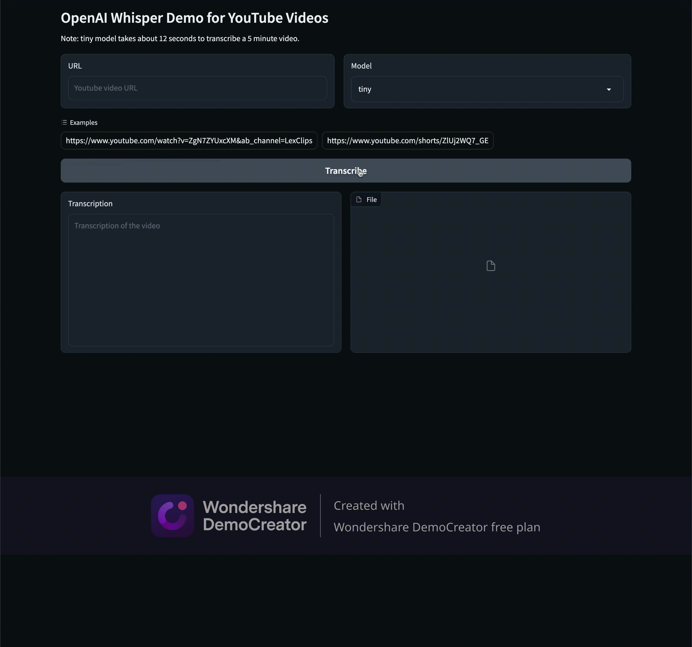

# Gradio Whisper model for transcribing YouTube videos

Transcribe a YouTube video URL to text using the OpenAI Whisper model.

On an M2 Pro MacBook Pro with the `tiny` model, transcribing a 5 minute video takes about 12 seconds.



## Setup

```bash
virtualenv venv --python=3.9
source venv/bin/activate
pip install -r requirements.txt
gradio app.py
```

Then visit localhost:7860 in your browser.